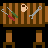

[![Contributors][contributors-shield]]()
[![Forks][forks-shield]]()
[![Stargazers][stars-shield]]()
[![Issues][issues-shield]]()
[![MIT License][license-shield]][license-url]


<!-- PROJECT LOGO -->
<br />
<p align="center">
  <a href="https://github.com/HaroldPetersInskipp/Workshop">
    
  </a>

  <h3 align="center">Workshop</h3>

  <p align="center">
    Personal/Projects website
    <br />
    <a href="https://github.com/HaroldPetersInskipp/Workshop"><strong>Explore the docs »</strong></a>
    <br />
    <br />
    <a href="https://github.com/HaroldPetersInskipp/Workshop/tree/main/JS/Roguelike">View Demo</a>
    ·
    <a href="https://github.com/HaroldPetersInskipp/Workshop/issues">Report Bug</a>
    ·
    <a href="https://github.com/HaroldPetersInskipp/Workshop/issues">Request Feature</a>
  </p>
</p>


<!-- TABLE OF CONTENTS -->
<details open="open">
  <summary><h2 style="display: inline-block">Table of Contents</h2></summary>
  <ol>
    <li>
      <a href="#about-the-project">About The Workshop</a>
      <ul>
        <li><a href="#built-with">Built with HTML, CSS, Javascript and Pixel art.</a></li>
      </ul>
    </li>
    <li><a href="#Roguelike">Roguelike Project</a>
    <li><a href="#Commands">Useful Commands</a></li>
    <li><a href="#roadmap">Roadmap</a></li>
    <li><a href="#contributing">Contributing</a></li>
    <li><a href="#license">License</a></li>
    <li><a href="#contact">Contact</a></li>
    <li><a href="#acknowledgements">Acknowledgements</a></li>
  </ol>
</details>


<!-- ABOUT THE PROJECT -->
## About The Workshop

The Workshop is where I build and host my code, as well as Create art.
A home for my projects and a place to sharpen my development skills.

### Built With

* HTML
* CSS
* Javascript
* Pixel art


## Roguelike

A small developement showcase of code, art, and quick projects. Interested in hiring me for your project? Contact me at Kalordrol2000@yahoo.com

### Commands


#### Ubuntu

How to start xrdp server on Ubuntu
* Commands
  ```sh
  sudo /etc/init.d/xrdp start
  ```

#### Darknet

1. Detect
   ```sh
   ./darknet detector test cfg/coco.data cfg/yolov4.cfg cfg/yolov4.weights
   ```
2. Detect and output
   ```sh
   ./darknet detector test cfg/coco.data cfg/yolov4.cfg cfg/yolov4.weights -ext_output data/image0.jpg
   ```


<!-- USAGE EXAMPLES -->
## Usage

Use this space to show useful examples of how a project can be used. Additional screenshots, code examples and demos work well in this space. You may also link to more resources.

_For more examples, please refer to the [Documentation](https://example.com)_


<!-- ROADMAP -->
## Roadmap

See the [open issues](https://github.com/HaroldPetersInskipp/Workshop/issues) for a list of proposed features (and known issues).


<!-- CONTRIBUTING -->
## Contributing

Contributions are what make the open source community such an amazing place to be learn, inspire, and create. Any contributions you make are **greatly appreciated**.

1. Fork the Project
2. Create your Feature Branch (`git checkout -b feature/AmazingFeature`)
3. Commit your Changes (`git commit -m 'Add some AmazingFeature'`)
4. Push to the Branch (`git push origin feature/AmazingFeature`)
5. Open a Pull Request


<!-- LICENSE -->
## License

Distributed under the MIT License. See `LICENSE` for more information.


<!-- CONTACT -->
## Contact

St1ngyJ4ck - [@twitter_handle](https://twitter.com/St1ngyJ4ck) - Kalordrol2000@yahoo.com

Project Link: [https://github.com/HaroldPetersInskipp/Workshop](https://github.com/HaroldPetersInskipp/Workshop)


<!-- ACKNOWLEDGEMENTS -->
## Acknowledgements

* []()
* []()
* []()


<!-- MARKDOWN LINKS & IMAGES -->
<!-- https://www.markdownguide.org/basic-syntax/#reference-style-links -->
[contributors-shield]: https://img.shields.io/github/contributors/HaroldPetersInskipp/Workshop.svg?style=for-the-badge
[contributors-url]: https://github.com/HaroldPetersInskipp/Workshop/graphs/contributors
[forks-shield]: https://img.shields.io/github/forks/HaroldPetersInskipp/Workshop.svg?style=for-the-badge
[forks-url]: https://github.com/HaroldPetersInskipp/Workshop/network/members
[stars-shield]: https://img.shields.io/github/stars/HaroldPetersInskipp/Workshop.svg?style=for-the-badge
[stars-url]: https://github.com/HaroldPetersInskipp/Workshop/stargazers
[issues-shield]: https://img.shields.io/github/issues/HaroldPetersInskipp/Workshop.svg?style=for-the-badge
[issues-url]: https://github.com/HaroldPetersInskipp/Workshop/issues
[license-shield]: https://img.shields.io/github/license/HaroldPetersInskipp/Workshop.svg?style=for-the-badge
[license-url]: https://github.com/HaroldPetersInskipp/Workshop/blob/master/LICENSE.txt
